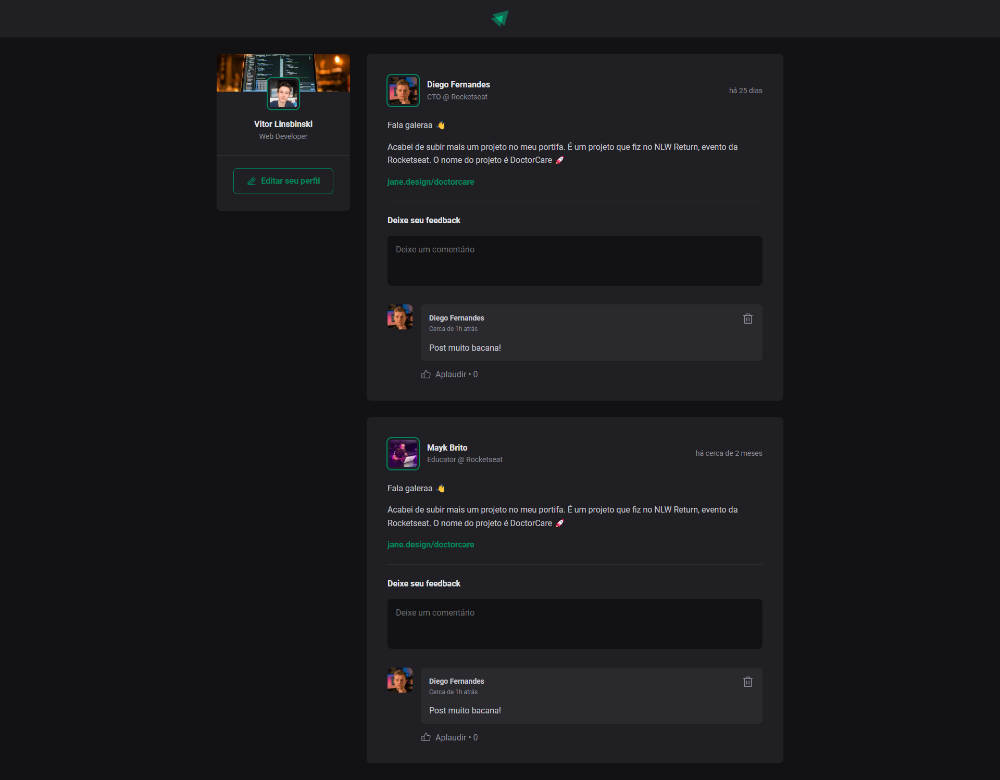

# ignite-feed

This is the first project developed in the Ignite Course by Rocketseat to be introduced in ReactJS with TypeScript.

## Concepts introduced
- States
- State Immutability
- Lists and Keys in ReactJS
- Properties
- Componentization
- TypeScript
- CSS Modules
- Responsivity
- Forms and Form's Validation

## Functionalities
- Add a comment
- Delete a comment

[Ignite Feed Deploy](https://vitorlinsbinski.github.io/ignite-feed/) 
</img>
